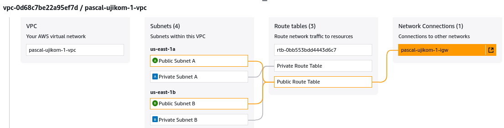
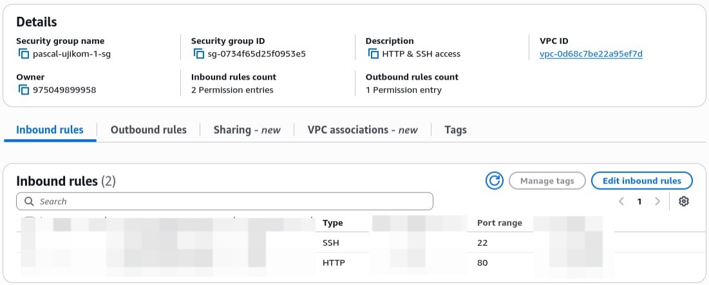
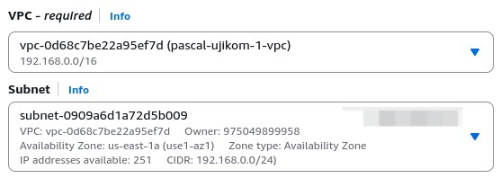
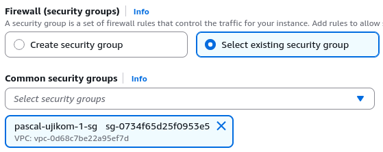
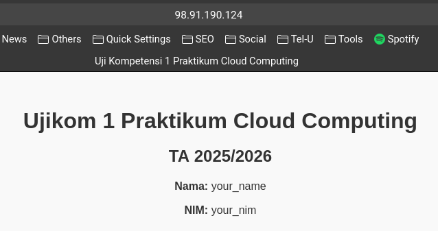

<h1 style="text-align: center;">UJI KOMPETENSI 1   Praktikum Cloud Computing</h1>

**Tujuan:**  
Untuk menguji pemahaman praktikal dalam membangun infrastruktur cloud dasar pada AWS yang meliputi pembuatan Virtual Private Cloud (VPC), Security Group, EC2 Instance, serta konfigurasi web server.

**Instruksi Umum:**  
1. Dokumentasikan setiap langkah yang dilakukan.  
2. Kumpulkan hasil pengerjaan dalam format PDF yang mencakup penjelasan dan tangkapan layar (screenshot) setiap tahapan.

<h1 style="text-align: center;">TUGAS</h1>

### 1. Membuat Virtual Private Cloud (VPC)

Buatlah sebuah VPC dengan spesifikasi berikut:  
- **IPv4 CIDR block:** `192.168.0.0/16`  
- **Hasil Akhir:** Tampilan Resource Map VPC yang sesuai dengan contoh berikut.  
  *(Gantilah "your AWS virtual network" dan "Network Connections" dengan nama Anda)*  

---

### 2. Mengonfigurasi Security Group

Buat sebuah Security Group yang mengizinkan akses inbound pada port berikut:  
- **Port 80** (HTTP)  
- **Port 22** (SSH)  
Konfigurasi harus sesuai dengan ilustrasi berikut:

---

### 3. Meluncurkan EC2 Instance

Buat sebuah instance EC2 dengan ketentuan sebagai berikut:  
- **Nama Instance:** `nama-ujikom-1-ec2`  
- **Amazon Machine Image (AMI):** Ubuntu  
- **Network Settings:**  
  - Gunakan VPC dan subnet yang telah dibuat pada langkah 1.  

- **Firewall (Security Group):**  
  - Gunakan Security Group yang telah dibuat pada langkah 2.  

---

### 4. Konfigurasi Web Server

Pada instance EC2 yang telah dibuat:  
- Instal dan konfigurasi sebuah web server (mis., Apache atau Nginx).  
- Buat halaman web yang menampilkan:  
  - Pesan "Ujikom 1 Praktikum Cloud Computing" dengan "Nama" dan "NIM" Anda 
  - Alamat IP publik dari instance tersebut.  
- Hasil tampilan web harus sesuai dengan contoh berikut:

---

### 5. Dokumentasi dan Pengumpulan

Buat sebuah laporan yang berisi:  
- Langkah-langkah rinci pengerjaan setiap tugas.  
- Tangkapan layar setiap tahapan konfigurasi sebagai bukti pekerjaan.  
- Kumpulkan laporan akhir dalam format PDF.

---

**Semoga ujian ini dapat mengukur kompetensi Anda dalam penerapan cloud computing.**  
**Selamat bekerja!**